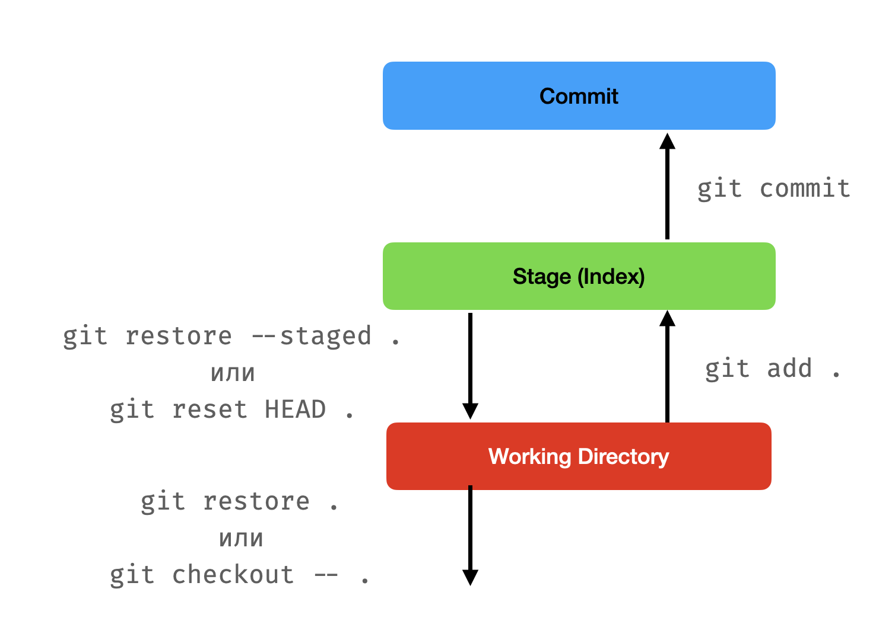

# Работа с Git

Тази тема не е пряко свързана с Python, но е необходимо всеки от вас да е усвоил понятията от нея, понеже:
1. Всички домашни се предават чрез GitHub Classroom, което изисква да се работи с Git.
2. Version control системи на работа винаги се използват и много рядко са нещо различно от Git (освен ако нямате късмета на Любо).

## Какво е Git?

Децентрализирана система за контрол на версиите на сорс кода. 

Накратко: това означава, че може да се възстановяват предишни версии на кода, като се пази и историята на промените на всеки файл от проекта. Git (и други системи за контрол на версиите) са причината хората да не си разменят zip файлчета с код насам-натам и да не получават инфаркт ако се направи фатална грешка, след която кодът на проекта трябва да се върне до предишно по-стабилно състояние. Git ни предоставя начин за колабориране с други колеги, чрез внасяне и сливане на промени по кода по прозрачен начин и обратим начин.

## Как да изтегля Git?

`git` е командата, която се използва за да управляваме repository-та чрез Git. Тя има много подкоманди, които се използват за различни цели. Сред най-използваните са `git clone`, `git add`, `git commit`, `git push`, `git pull`, `git merge` и други. Ще ги обясним подробно малко по-нататък.

* **Windows**: препоръчва се инсталирането на [Git Bash](https://git-scm.com/download/win), което инсталира `git` и предоставя терминал, който позволява използването на `bash` команди и синтаксис и е доста по-удобен от `cmd.exe` примерно.
* **Linux**: би трябвало да го има вече за повечето дистрибуции. Ако все пак го няма: копи-пейст на съответната команда [оттука](https://git-scm.com/download/linux):
* **macOS**: ако имате XCode command-line tools инсталирани (които идват с XCode), значи би трябвало да имате `git`. Ако все пак нямате, ползвайте Homebrew да си го сложите: `brew install git`.

## Как да управлявам папки с Git?

За да бъде една папка, както и подпапките ѝ, поддържана от Git, трябва да  съществува скритата папка `.git` в нея с необходимите за работата на Git файлове. Там се пазят т.нар. "refs" (references) към съдържанието на всички файлове и историята на техните промени.

Такава папка се нарича Git repository. За да създадем такава, трябва да изпълним командата [`git init`](https://www.atlassian.com/git/tutorials/setting-up-a-repository/git-init) в root-a на папката, която искаме да поддържаме с Git (т.е. тази, която да стане нашето repository, заедно с подпапките си).

## Как се пази и следи историята?

Промените в Git се разделят на т.нар. ***commit***-и.

Всеки commit съдържа:

  * **hash**: уникален идентификатор (хешкод) на commit-a, който се генерира автоматично.
  * **message**: кратко описание на промените
  * **parents**: кой/кои са предшествениците на този commit. Всеки commit има обикновено точно един предшественик (освен първия, който няма такива). Един commit може да има няколко предшественика, ако е в следствие на ***merge*** операция например.
  * **author**: кой е направил промените
  * **date**: кога са направени промените

Историята на commit-ите на практика представлява нещо като дърво, в който всеки node е commit, имаш пойнтър към предишния такъв (понякога към повече от 1 предишни, в случай на merge). Тя е достъпна чрез [`git log`](https://www.atlassian.com/git/tutorials/git-log).

Всеки commit се асоциира и със съответните промени, които той донася в кодбазата (т.е. във файловете в repository-то). Това се нарича ***diff***. Различните видове промени биват добавяне и премахване на ред, добавяне, изтриване и преименуване на файл. Чрез [`git diff`](https://www.atlassian.com/git/tutorials/saving-changes/git-diff) може да се направи сравнение между две версии на файлове.

Ако искаме да отидем до някой специфичен къмит, използваме `git checkout <commit-hash>`. Това ще промени съдържанието на файловете в директорията, така че да отговарят на състоянието на кода в този commit.

Обикновено, за да можем паралелно да работим с други хора, или пък да пазим различни състояние едновременно, искаме да използваме различни бранчове (branches). Един branch на практика представлява пойнтър към даден commit. Управлението им става чрез [`git branch`](https://www.atlassian.com/git/tutorials/using-branches), а преминаването от един в друг - чрез [`git checkout <branch-name>`](https://www.atlassian.com/git/tutorials/using-branches/git-checkout). Когато сме в даден бранч и създадем нов къмит, бранчът ще бъде променен да сочи към новия къмит (чийто предшественик е предходния) и по този начин създаваме и развиваме на практика нов свързан клон на дървото на промените.

## Как да създам нови commit-и?

Да речем, че имаме папка `my-project`, която е празна. Изпълняваме `git init`, за да я добавим към Git. Изпълняваме `git status`, за да проверим на кой бранч се намираме и какво е текущото състояние на промените и индекса:

```
On branch master

No commits yet

nothing to commit (create/copy files and use "git add" to track)
```

Това означава, че сме в бранч на име `master` - това е името по подразбиране за главен бранч. След бунтовете от 2020 във връзка с Джордж Флойд обаче все повече се налага и името `main`, така че може и това да срещнете (an interesting read on the histeria that was then: https://github.com/rubocop/rubocop/issues/8091 (hail Bacov)).

Да речем също, че искаме като за първи къмит да добавим файл `main.py` със следното съдържание:

```python
print("Hello, world!")
```

Нека първия ни commit-a се казва "Initial commit". Създаването му би станало с `git commit -m "Initial commit"`. Ако се опитаме в момента обаче да го изпълним, ще получим грешка със съобщение, че нямаме никакви промени, които да къмитнем:

```
nothing added to commit but untracked files present (use "git add" to track)
```

Как така, нали добавихме файл?

Това е защото първо трябва да го добавим към индекса. 

Т.нар. index/staging е междинно "място", съдържащо промените ни, които искаме да включим в следващия къмит (т.е. които `git commit` ще вземе). 

При изпълнение на `git status` в момента виждаме:

```
Untracked files:
  (use "git add <file>..." to include in what will be committed)
	main.py
```

"Untracked files" означава нови файлове, които досега не са били част от репозиторито.

За да добавим промени/файлове към индекса, трябва да изпълним `git add <file>`. В нашия случай - `git add main.py`. (Или `git add .` - това добавя абс. всичко към индекса).

След изпълнението му, `git status` вече показва:

``` 
Changes to be committed:
  (use "git rm --cached <file>..." to unstage)
	new file:   main.py
```

Премахване на файлове/промени от индекса най-общо казано става с `git restore --staged <file>` или с `git resed HEAD <file>`. Това не променя файла, а просто го премахва от индекса - т.е. `git commit` просто няма да вземе тези промени, но те си остават в текущата директория.

Сега вече можем да си направим къмита с `git commit -m "Initial commit"`.

След като сме направили къмита, `git status` вече показва:

```
On branch master
nothing to commit, working tree clean
```

С `git log` можем да видим новия къмит в дървото на историята:

```
commit 0a2ba7a9d3af36dd03a656955e2b246b9b1c8dc7 (HEAD -> master)
Author: Alexander Ignatov <aleksandar.ignatov@smule.com>
Date:   Mon Oct 3 22:02:28 2022 +0300

    Initial commit
```

След това за да добавим още къмити, ако трябва да обобщим, трябва да направим следните неща:
1. Добавяме промени към индекса с `git add <file1> <file2> ...`
2. Къмитваме промените с `git commit -m "Commit message"` (или `git commit` - това ще отвори текстов редактор, в който ще трябва да напишете съобщението си. При невъзможност за излизане от `vim`, моля позвънете на 112).



## Как да кача/сваля промените си към/от друго репозитори?

Git е децентрализиран. Към всяко едно репозитори могат да се добавят един или повече т.нар. remotes. Това са други репозиторита, с които нашето може да синхронизира къмити и бранчове. Те се добавят с `git remote add <remote_name> <remote_url>`. Общоприето е да се използва `origin` за името на remote-а, ако е един и/или има централна роля.

За пример, ако имаме репозитори в GitHub създадено и искаме да го свържем с нашето, трябва да го добавим чрез HTTPS линка му с `git remote add origin https://github.com/user/reponame`. (SSH е предпочитан с цел по-добра сигурност). Това свързване става автоматично, ако нямаме локална копие на репото и използваме `git clone` за да го създадем, например в този случай `git clone https://github.com/user/reponame`,

За да свържем наш локален бранч към такъв, намиращ се в `origin`, трябва да изпълним `git branch --set-upstream-to=origin/<branch_name> <branch_name>`. Това ще създаде локален бранч с името на remote-а и името на бранча, към който сме свързали нашия. Това е нещо, което може да се направи и автоматично, като се отиде на съответния бранч с `git checkout <branch_name>`, ако `<branch_name>` е име на бранч, който още нямаме локално, но вече съществува на remote-a.

За да качим промените си, трябва да изпълним `git push`. Това ще качи всички промени, които имаме локално на текущия бранч, към remote-а, към който сме свързани, и на бранча, към който текущия е свързан. В случай, че не е свързан с никой, то тогава ще трябва да изпълним `git push -u origin <branch_name>`, където `<branch_name>` е името на бранча, намиращ се в origin, към който искаме да качим промените си (обикновено същото име като текущия локален).

Хубаво е периодично да се прави `git fetch`. Това обновява ref-овете с тези, намиращи се на remote-а. Това не променя локалните файлове, а само обновява информацията за къмити и бранчове, достъпни на remote-а.

За да обновим наш бранч до състоянието на remote-а, трябва да изпълним `git pull` (за по-сложни репозиторита се препоръчва и с параметър `--rebase`). Това ще извлече промените от remote-а и ще ги слеят с текущия бранч. Това е еквивалентно на последователното изпълнение на `git fetch` и `git merge FETCH_HEAD`.

## Как да сливаме промени?

Има два основни метода - merge и rebase. Тук ще говорим само за merge.

Когато сливаме два бранча, то това означава, че искаме да включим промените от единия бранч в другия. Ако искаме например да включим промените от бранч `A` в бранч `B`, то трябва:

0. Да се уверим, че локалното съдържание в бранч А е последното, в случай, че има шанс то да е променено на remote-a (`git checkout A && git pull`).
1. Да отидем на бранч B (`git checkout B`)
2. Да изпълним `git merge A`
3. Да оправим конфликтите, ако има такива
    1. В конфликтите части от файловете ще се появят merge маркери, които изглеждат по подобен начин:
    ```
    <<<<<<< HEAD
    Тук е конфликтното съдържание на файла в бранча, в който сме
    =======
    Тук е конфликтното съдържание на файла в бранча, който сливаме
    >>>>>>> A
    ```
    2. Трябва да оправим конфликтите, като изтрием всичко, което не искаме да остане и да оставим само това, което искаме да остане (Captain Obvious here)
    3. След save-ване на файловете, трябва да ги добавим в индекса (`git add <file1> <file2> ...`)
    4. Изпълняваме `git commit` и обикновено не променяме съобщението по подразбиране (ако се отвори `vim` и отново не можете да излезете, подайте жалба [тук](https://armenskipop.com))

Тази процедура ще създаде нов merge commit в B, който има 2 parent-a: последния къмит в А и последния такъв в B. Бранч А е успешно слят с B и вече може спокойно да бъде изтрит.

## Pro tips for people living in the terminal

1. За улеснение препоръчваме използването на теми и плъгини за терминала, които показват като част от prompt-a информация като това текущата директория дали е под git, в кой бранч се намира в момента и т.н. В Git Bash това е вградено, а за `zsh` (или `bash`) може да изтеглят framework-ове и плъгини, като например [oh-my-zsh](https://ohmyz.sh).

2. [`diff-so-fancy`](https://github.com/so-fancy/diff-so-fancy) е tool, който прави четенето на diff-ове в терминала една идея по-човешко (за който е hardcore и държи да си ползва терминала вместо някой GUI като [SourceTree](https://www.sourcetreeapp.com) например или дори вградената Git функционалност на VSCode).

3. Писането на команди като `git status`, `git checkout` и т.н. бързо се превръща в нещо, което ни се иска да не ни отнема толкова време да пишем. За да се спести време, може да се използват alias-и, които са съкращения на командите. Например, ако искаме да съкратим `git status` до `gs`, можем да напишем във файла с настройките на терминала (`.bashrc` или `.zshrc`) следното:
```bash
alias gs='git status'
```

4. Идеи за alias-и, теми, плъгини и т.н. за `zsh` и `oh-my-zsh` може да почерпите от нечии dotfiles, като например [моите](https://github.com/yalishanda42/dotfiles).
